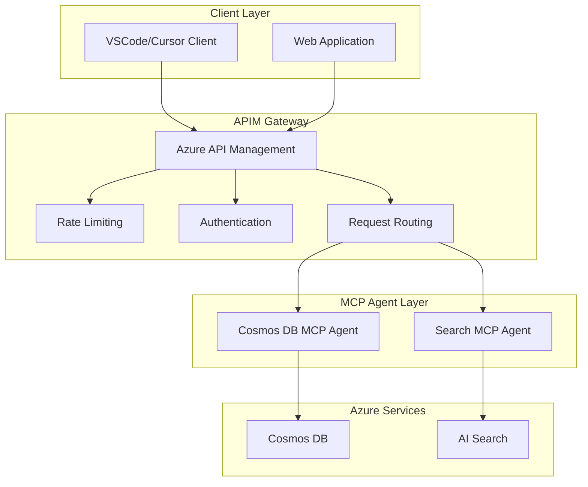

# FreshMCP

A Python-based service that provides a Message Control Protocol (MCP) interface for FreshMCP operations using Azure Cosmos DB and AI Search.

## Overview

FreshMCP is a comprehensive service that provides standardized interfaces for interacting with Azure services:

### Cosmos DB Operations

- Container management (create, list, delete)
- Item operations (create, read, update, delete, query)

### AI Search Operations

- Create index
- List indexes
- Delete index

---

## Architecture & Flow

### System Architecture



### Request Flow

1. **Client Request**: VSCode/Cursor or web application sends request to APIM
2. **APIM Processing**:
   - Authentication and authorization
   - Rate limiting and throttling
   - Request routing based on service type
3. **MCP Agent Processing**:
   - Tool execution based on request type
   - Service-specific operations
   - Response formatting
4. **Azure Service Interaction**:
   - Direct API calls to Azure services
   - Data retrieval and manipulation
   - Telemetry collection

### APIM Configuration

The Azure API Management (APIM) serves as the central gateway for all MCP agent communications:

- **Authentication**: Subscription key-based authentication
- **Rate Limiting**: Configurable limits per subscription
- **Routing**: Intelligent routing to appropriate MCP agents
- **Monitoring**: Built-in analytics and monitoring
- **Caching**: Response caching for improved performance

### MCP Agent Communication

Each MCP agent communicates via Server-Sent Events (SSE) protocol:

- **Cosmos DB Agent**: Handles all database operations
- **Search Agent**: Manages AI Search index operations

---

## Prerequisites

- Python 3.11 or higher
- Azure CLI
- Azure Developer CLI (azd)
- Docker
- Azure subscription with appropriate permissions

---

## Local Development Setup

1. Clone the repository:

2. Install uv (if not already installed):

```bash
pip install uv
```

3. Create and activate a virtual environment using uv:

```bash
uv venv

# Windows
.venv\Scripts\activate

# Linux/Mac
source .venv/bin/activate
```

4. Install dependencies using uv:

```bash
uv sync
```

5. Set up environment variables:

```bash
cp .env.example .env
# Edit .env with your Azure credentials and service settings
```

### Server Endpoints

**Start the Cosmos DB MCP server:**

```bash
python -m src.cosmos.mcp.server
```

> The server will start on `http://localhost:8001/cosmos/sse`

**Start the AI Search MCP server:**

```bash
python -m src.search.mcp.server
```

> The server will start on `http://localhost:8002/search/sse`

---

## Setting up the MCP to the client

Add the tools of any MCP server to VSCode or Cursor providing a JSON configuration file below:

**VSCode**:

```json
{
  "servers": {
    "cosmos_mcp_local": {
      "type": "sse",
      "url": "http://localhost:8001/cosmos/sse"
    },
    "search_mcp_local": {
      "type": "sse",
      "url": "http://localhost:8002/search/sse"
    }
  }
}
```

**Cursor**:

```json
{
  "mcpServers": {
    "cosmos_mcp_local": {
      "type": "sse",
      "url": "http://localhost:8001/cosmos/sse"
    },
    "search_mcp_local": {
      "type": "sse",
      "url": "http://localhost:8002/search/sse"
    }
  }
}
```

---

## Deployment with Azure Developer CLI (azd)

1. Initialize azd (if not already done):

```bash
azd init -e dev -l eastus

# -e dev is optional, it will create a new dev environment

# -l eastus is optional, it will create the resources in the eastus region
```

2. Deploy the application:

```bash
azd up
```

This will:

- Packages the project/services
- Provision all the necessary Azure services
- Build and push the Docker images to the Azure Container Registry
- Deploy the images to the Azure Container Apps

---

## Setting up RBAC for Azure Services

### Cosmos DB RBAC

1. Create a user-assigned managed identity:

```bash
az identity create --name fresh-mcp-identity --resource-group <your-resource-group>
```

2. Grant the necessary RBAC role to the managed identity:

```bash
az cosmosdb sql role assignment create \
    --account-name <your-cosmos-account> \
    --resource-group <your-resource-group> \
    --role-definition-id "00000000-0000-0000-0000-000000000002" \
    --principal-id <managed-identity-principal-id> \
    --scope "/"
```

3. Assign the managed identity to your Container App:

```bash
az containerapp identity assign \
    --name <your-container-app> \
    --resource-group <your-resource-group> \
    --user-assigned <managed-identity-resource-id>
```

### AI Search RBAC

1. Grant the necessary RBAC role to the managed identity:

```bash
az role assignment create \
    --assignee <managed-identity-principal-id> \
    --role "Search Service Contributor" \
    --scope /subscriptions/<subscription-id>/resourceGroups/<resource-group>/providers/Microsoft.Search/searchServices/<search-service-name>
```

---

## Environment Variables

Required environment variables (use a table to list them):

| Variable | Description | Required |
|----------|-------------|----------|
| `AZURE_TENANT_ID` | Azure tenant ID | Yes (If using Service Principal) |
| `AZURE_CLIENT_ID` | Client ID for authentication | Yes (If using Service Principal) |
| `AZURE_CLIENT_SECRET` | Client secret for authentication | Yes (If using Service Principal) |
| `APPLICATIONINSIGHTS_CONNECTION_STRING` | Application Insights connection string | No |

---

## Monitoring

To monitor your application:

```bash
azd monitor -e dev
```

---

## Contributing

1. Fork the repository
2. Create a feature branch
3. Commit your changes
4. Push to the branch
5. Create a Pull Request

---

## License

This project is licensed under the MIT License - see the LICENSE file for details.